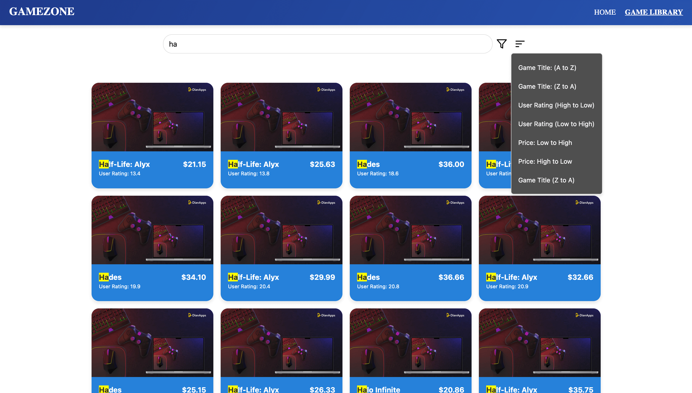
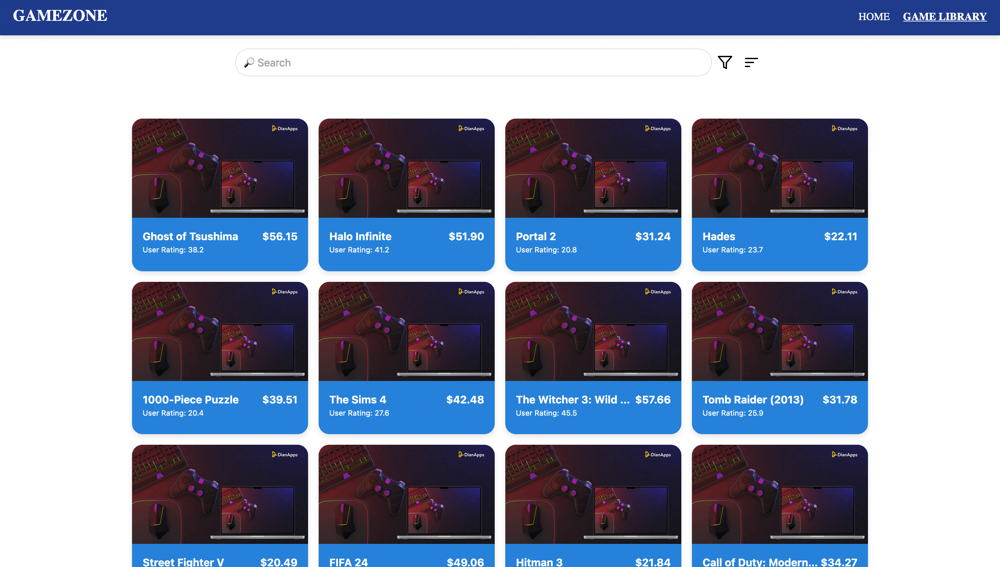
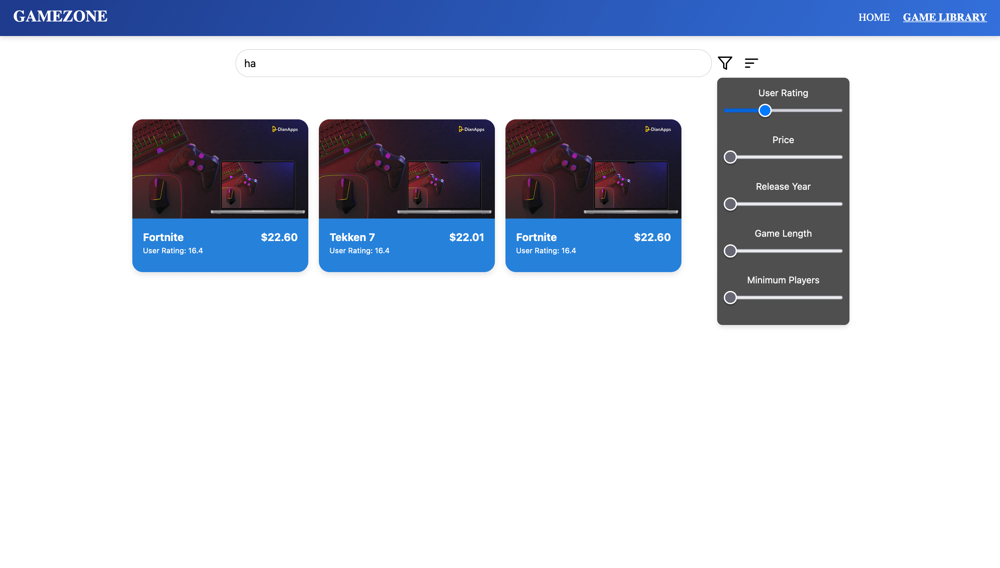
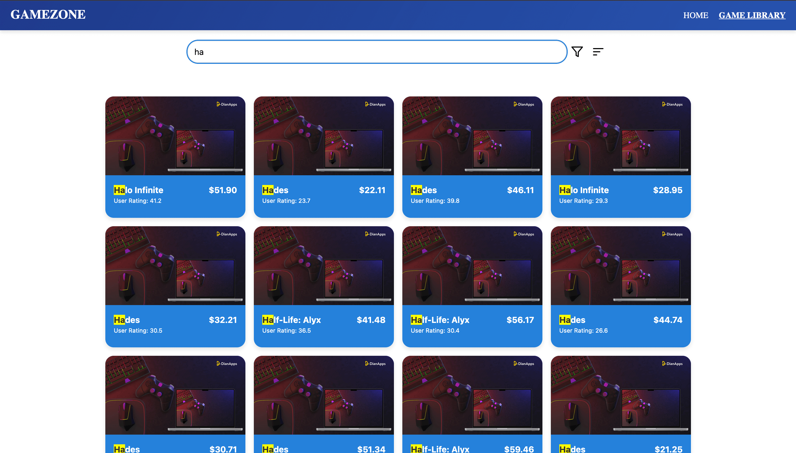
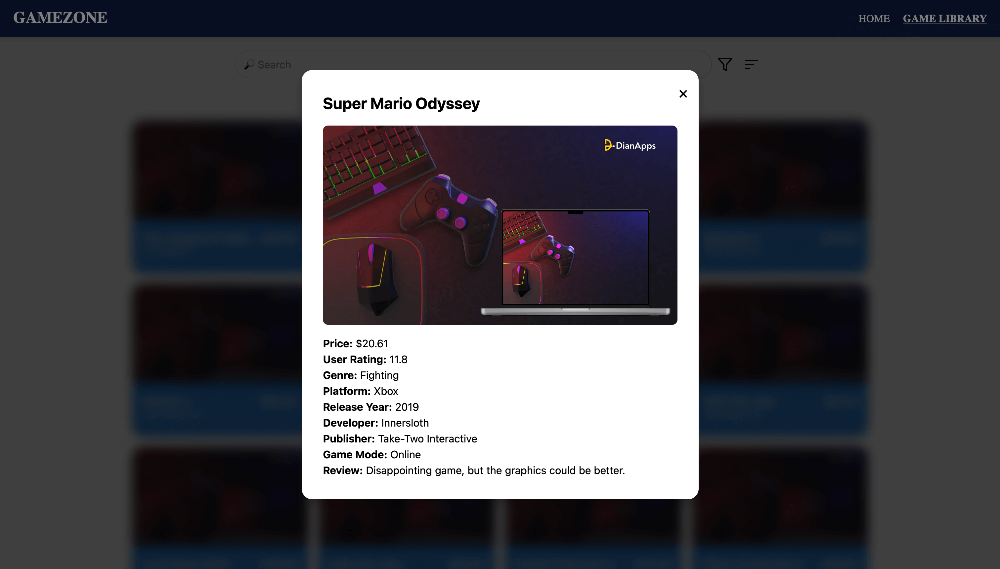

**Game Library App**

This is a [Next.js](https://nextjs.org) project bootstrapped with [create-next-app](https://nextjs.org/docs/app/api-reference/cli/create-next-app).

**Features**

-  Search, sort, and filter games in the library.

### Sort in Action
Easily sort the game library by various attributes like user rating, price, and release year.



### Game Library
The game library allows you to search, sort, and filter games dynamically with a sleek and interactive UI.



### Filter in Action
Filter the games by genre, price range, or user rating for a tailored experience.



### Search in Action 
Search the games by Title. 


### Expanded Card Layout 
Check addiotional details about your game like Genre, Release Year etc.



-  Backend powered by [Weaviate](https://weaviate.io), with data from a Kaggle dataset (dummy link for now).

-  Easy setup and testing instructions provided below.


**Getting Started**

**Prerequisites**

-  **Python**: Ensure Python is installed on your machine.

-  **Node.js**: Install [Node.js](https://nodejs.org/) (v16 or above recommended).

-  **npm or yarn**: Package manager for managing dependencies.


**Setup**

**1\. Python Virtual Environment**

1.  Create a virtual environment:


```bash
python -m venv weaviate_env
```

2.  Activate the virtual environment:

-  On Windows:

```bash
weaviate_env\Scripts\activate
```

-  On macOS/Linux:

```bash
source weaviate_env/bin/activate
```

3.  Install the Python dependencies:
```bash
pip install -r requirements.txt
```

**Before populating schema and data onto weaviate cloud, create .env file with following:**
```bash
WCD_URL=your-weaviate-host               # Base URL of your Weaviate Cloud instance
WCD_API_KEY=your-weaviate-api-key        # API key for secure backend access to Weaviate
NEXT_PUBLIC_WEAVIATE_BASE_URL=public-graphql-js  # Public GraphQL endpoint for frontend
NEXT_PUBLIC_WEAVIATE_API_KEY=api-key-js  # API key for frontend use (public-facing)
```

**2\. Set Up Weaviate**

1.  Run the weaviate.ipynb Jupyter notebook to set up the schema and add data to your Weaviate cloud instance.

2.  Data is sourced from a Kaggle dataset. The .json file with the data is located in the root directory of this project.

[Kaggle-Link](https://www.kaggle.com/datasets/jahnavipaliwal/video-game-reviews-and-ratings/data)

**3\. Install Node.js Dependencies**

1.  Run the following command to install the required npm packages:
```bash
npm install
```
**4\. Run the Development Server**

1.  Start the development server:
```bash
npm run dev
```
2.  Open your browser and navigate to <http://localhost:3000>.

**Testing the Application**

**Routes**

1.  /: Home page of the application.

2.  /GameLibrary: Access the game library. You can:

-  Search for games by title.

-  Sort games by different attributes (e.g., rating, price, etc.).

-  Apply filters for a more customized view.


